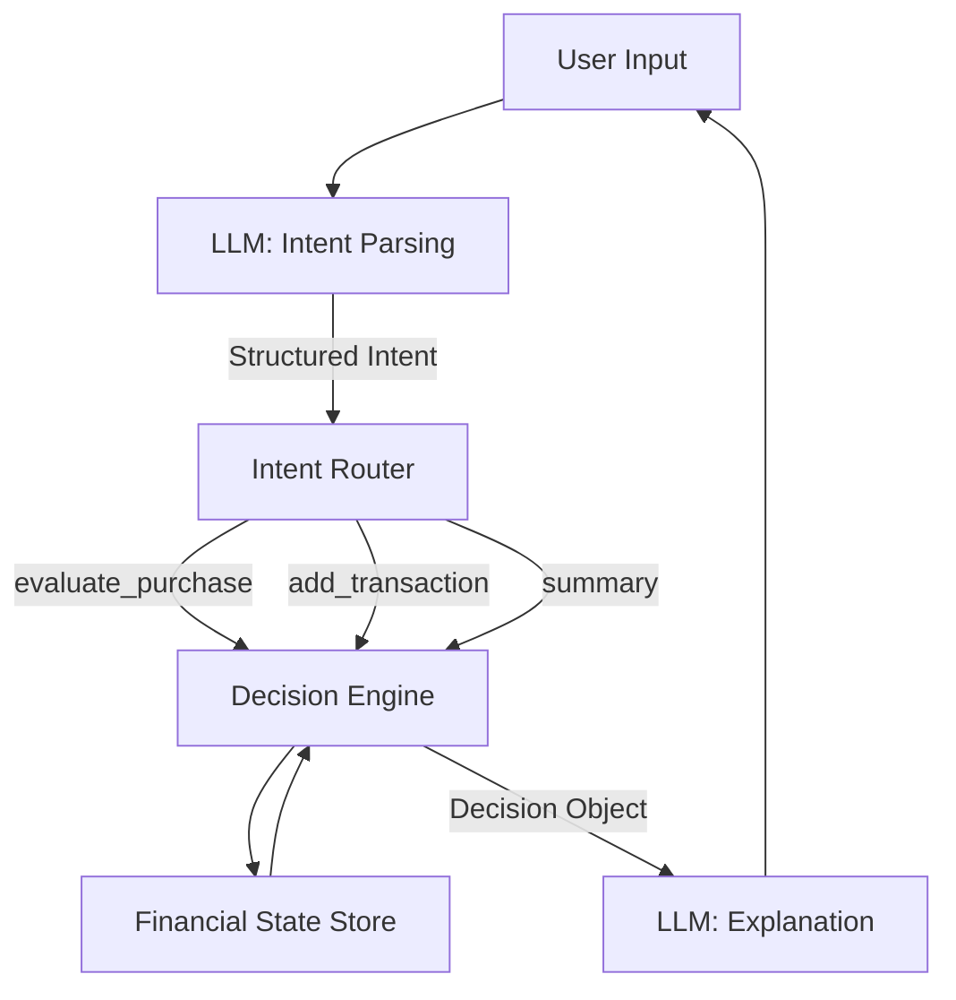

# Personal Finance Decision Engine (Portfolio Project)

## Overview

A constraint-based financial decision system built as a multi-user web application using FastAPI.
This project is a **Personal Finance Decision Engine** designed to evaluate user financial actions against explicit
constraints and goals.

It is **not** an autonomous AI agent that acts on its own.
It does **not** make decisions independently, execute transactions, or invent goals.

Instead, it is a **constraint-based decision system** that:

- Maintains financial state over time
- Evaluates user-initiated actions
- Produces deterministic decisions with clear reasoning
- Uses an LLM strictly as an interface and explanation layer

## What the system does

* Normalizes financial reality
    * Ingests transactions
    * Categorizes with confidence scores
    * Tracks recurring vs discretionary spend
* Builds a user financial model
    * Fixed vs variable costs
    * Savings rate, burn rate, cash runway
    * Behavioral patterns (weekends, subscriptions, drift)
* Generates decisions, not tips
    * “You should cap dining at $X because it reduces savings below Y%”
    * “Cancel subscription A before date B to avoid waste”
    * Every recommendation has a justification chain
* Explains tradeoffs
    * “If you keep spending pattern A, goal B is delayed by C months”
    * Scenario comparisons, not advice dumping
* Multi-User Considerations
    * Isolated user data and financial state
    * Secure authentication and authorization
    * Per-user budget constraints and goals
    * Scalable state management

---

## What This System Is (and Is Not)

### This system **is**:

- A stateful decision engine
- Event-driven and user-triggered
- Deterministic, testable, and auditable
- Explicit about constraints and tradeoffs

### This system is **not**:

- An autonomous agent
- A self-directed AI
- A chatbot that "figures things out"
- A system that executes financial actions on behalf of the user

**Agency ≠ autonomy.**
This system reasons about decisions; it does not act independently.

---

## Core Problem Statement

Given:

- A user’s historical spending data
- Explicit budgets and financial goals
- A proposed action (e.g. "buy this hat for $80")

Determine:

- Whether the action aligns with constraints and goals
- What tradeoffs it introduces
- Whether it should be encouraged, discouraged, or warned against

---

## High-Level System Design

The system is built around **explicit intent → deterministic execution → explanation**.

### Key Principles

- All financial logic is deterministic
- All state changes are explicit
- LLM output is never treated as ground truth
- Unsupported behavior is explicitly rejected

---

## Financial State Model

The system maintains a continuously updated financial state, including:

- Transaction history
- Category-level spending
- Recurring vs discretionary expenses
- Savings rate
- Active goals (e.g. emergency fund, trip)
- Budget thresholds (user-defined or approved suggestions)

This state is the single source of truth.

---

## Supported User Intents (Closed Set)

The system supports a **small, explicit set of intents**:
- `evaluate_purchase` - Assess impact of a potential purchase
- `add_transaction` - Record a completed transaction
- `get_spending_summary` - View spending patterns and trends
- `get_goal_status` - Check progress toward financial goals
- `set_budget` - Define or modify budget constraints
- `create_goal` - Establish new financial goals

Any request outside this set:

- Is rejected
- Or triggers a clarification request

This is intentional and by design.

---

## Example: "Can I buy this hat?"

### Step 1: Intent Extraction (LLM)

The LLM converts natural language into a structured request:

```json
{
  "intent": "evaluate_purchase",
  "amount": 80,
  "category": "discretionary",
  "timing": "now"
}
```

If required information is missing, the LLM asks for clarification.
It does not assume or invent values.

### Step 2: Deterministic Decision Evaluation

The decision engine:

* Loads current financial state
* Applies budget thresholds
* Evaluates goal impact
* Computes tradeoffs
* Produces a structured decision object:

```json
{
  "decision": "discourage",
  "reason": "Savings rate would drop below 15%",
  "impact": "Trip goal delayed by 3 weeks"
}
```

No LLM involvement at this stage.

### Step 3: Explanation (LLM)

The LLM converts the decision object into a human-readable explanation.
Example:
"Buying this hat would reduce your savings rate below your target and delay your trip by about three weeks. If you still
want it, you may need to reduce discretionary spending elsewhere this month."
The LLM does not modify decisions or state.

## Role of the LLM (Explicitly Limited)

### What the LLM Does

* Natural language → structured intent parsing
* Explanation of deterministic decisions
* Summarization of financial state
* Clarification when required data is missing

### What the LLM Does NOT Do

* Perform financial calculations
* Decide budgets or thresholds
* Mutate financial state
* Execute operations
* Generate advice without constraints

* The LLM is not the brain.
  It is the interface and narrator.

## Decision Engine Responsibilities

The core engine is fully deterministic and testable:

* Budget enforcement
* Threshold checks
* Goal impact analysis
* Scenario comparison
* Alert triggering

All decisions can be unit-tested with fixed inputs and outputs.

## Failure and Refusal Handling

If the system cannot confidently map input to a supported intent:

* It asks a clarification question
* Or explicitly refuses
  Example:

```
I can help evaluate purchases or summarize your spending, but I can’t assist with that request yet.”
```

This is a feature, not a limitation.

## Design Diagram

